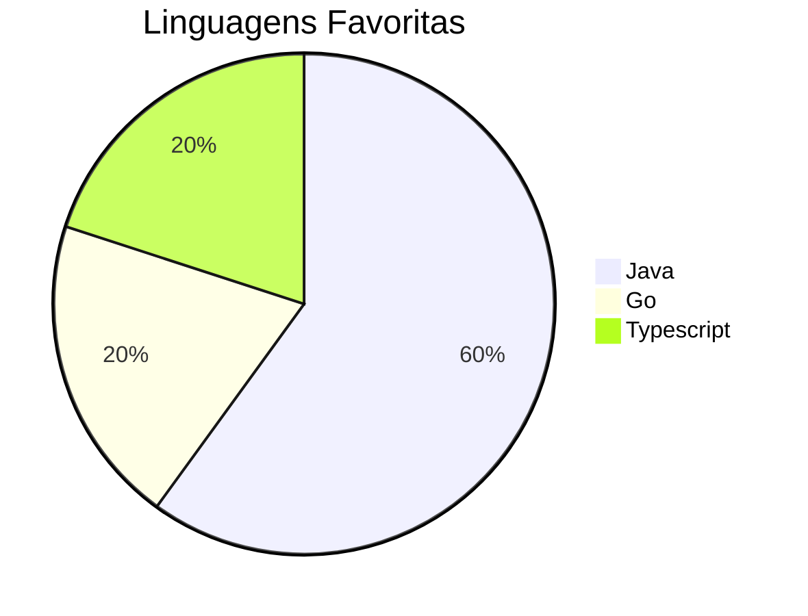

## Olá, sou o Guilherme 👋

- FullStack: Java, Go, Typescript, Angular, React.
- Analista de Infraestrutura On-premise e Cloud AWS
- AWS Certified
- Poços de Caldas - MG, Brasil  
- Aprendendo: IA, n8n, LMMs

### Tecnologias e Ferramentas
#### Programação

#### Cloud & DevOps  

### Bancos de Dados

### **Estatísticas do GitHub:**  

### Projetos

